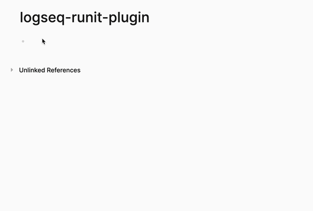

# logseq-runit-plugin

A Logseq plugin for running code snippets directly inside your notes.  
Supports JavaScript, Python (via [Pyodide](https://pyodide.org/)), and Scheme (via [BiwaScheme](https://www.biwascheme.org/)) with interactive output.  
Built for [Logseq](https://logseq.com/).



## Features

- **Multi-language support:** Run JavaScript, Python, and Scheme code blocks.
- **Console output capture:** See `console.log`/`print` output inline.
- **Last expression result:** Automatically displays the result of the last expression, similar to Jupyter notebooks.
- **Dynamic imports:** Supports dynamic module imports for JavaScript.
- **Easy insertion:** Use the `/Create Runit Snippet` slash command to insert runnable code blocks.

## Usage

1. Install the plugin in Logseq.
2. Use the `/Create Runit Snippet` command to insert a code block.
3. Write your code in JavaScript, Python, or Scheme inside the block.
4. The output and console logs will be displayed below the code.

### Importing External JavaScript Modules

You can import external JavaScript modules using a special magic comment at the top of your code block:

```js
// %import https://esm.sh/ramda as R

R.map(v => v + 1)([1, 2, 3, 4])

// output
Array [
  2,
  3,
  4,
  5,
]
```

Just replace the URL and alias (`R` in this example) as needed.  
This allows you to use libraries from CDNs like [esm.sh](https://esm.sh/) directly in your code snippets.


## Development

- Clone the repo and run `pnpm install`.
- Use `pnpm dev` to start development with hot reload.
- Build for production with `pnpm build`.

## Acknowledgments

Special thanks to [Klipse](https://github.com/viebel/klipse) for inspiration.  
Originally, I wanted to integrate Klipse directly, but due to some technical limitations, I implemented a simplified "code runner" based on some of Klipse's ideas.  

**Note:**  
Currently, code execution happens when the code editor loses focus, which is less interactive compared to Klipse.  
I plan to improve this in the future—ideally, running code with just <kbd>Ctrl+Enter</kbd>.

## License

MIT
